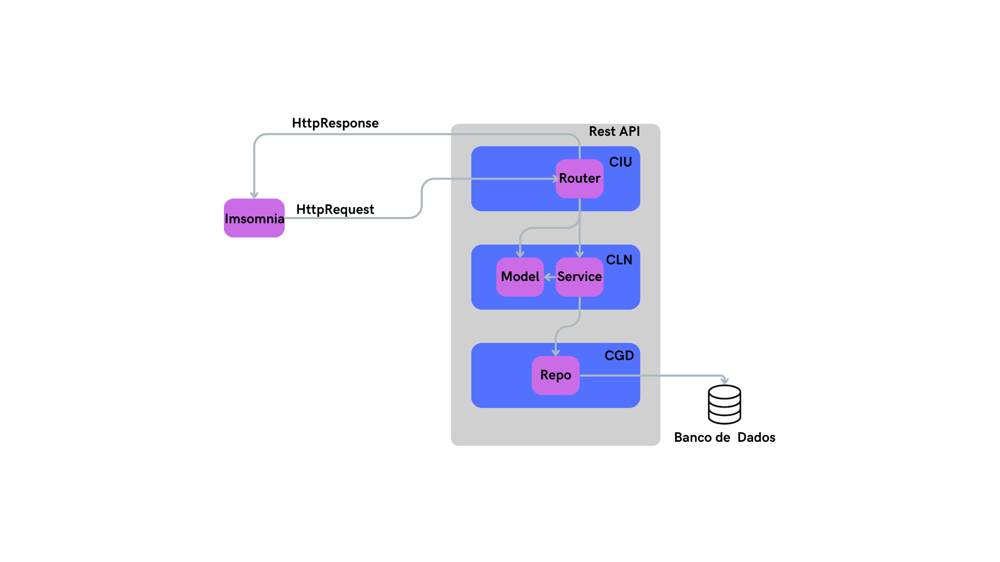

# Teste de Conhecimento em Backend - Labtel/2025

## 1. Introdução
No repositório está o código do teste de conhecimento em backend realizado pelo Laboratório de Telecomunicações. O programa tem como descrição:

> **Dada a necessidade do cliente em gerenciar a movimentação de estoque de produtos, é necessário desenvolver um conjunto de APIs que permitam atender a essa necessidade.**
>
> Nesse conjunto devemos ter:
> - Endpoints para cadastro de produtos.
> - Endpoints para movimentações de entrada e saída.
> - Um endpoint que retorne os dados de quantidade de entrada, saída e estoque do produto.
>
> O cliente terá:
> - Um endpoint para informar os dados do produto.
> - Um endpoint para informar a movimentação de entrada ou saída.
> - Um endpoint que retorne os dados de movimentação e estoque do produto.


## 2. Tecnologias Utilizadas

O projeto foi desenvolvido utilizando as seguintes tecnologias:

- **WSL/Ubuntu** - Sistema Operacional utilizado;
- **Python** - Linguagem de programação principal;
- **FastAPI** - Framework para desenvolvimento de APIs em Python;
- **MySQL** - Banco de dados relacional;
- **Docker** - Para containerização e gestão de ambientes;
- **Visual Studio** - Editor utilizado para o desenvolvimento;
- **SQLAlchemy** - ORM (Object Relational Mapper) utilizado para mapear as tabelas do banco de dados em classes Python;
- **Insomnia** - Ferramenta de testes de API utilizada para realizar requisições e validar os endpoints desenvolvidos;

## 3. Passo a Passo para Rodar o Backend

### 3.1. Clonar o Repositório
```bash
git clone https://github.com/JoaoGBarros/labtel_backend.git
cd labtel_backend
```

### 3.2. Configurar o ambiente

Caso queira realizar o passo a passo da configuração do ambiente, siga o [roteiro criado pelos alunos do laboratório](https://github.com/EstudosCpid/mini-curso-backend-2025/blob/main/Roteiro_Mini-Curso-Backend.md). Caso deseje popular incialmente o banco de dados, utilize do comando:

``` bash
docker exec -i <nome-do-container> mysql -uroot -p<senha> <nome-do-banco> < ./db/init.sql
```

Para agilizar, pode ser utilizado o programa `setup.sh` utilizando o comando em seu terminal

```bash
./setup.sh
```

O programa irá:

- Criar um container Docker contendo o banco de dados MySQL;

- Criar o ambiente virtual Python;

- Instalar as dependências do projeto;

- Gerar e aplicar as migrações do banco de dados com o Alembic;

- Popular o banco com dados iniciais, caso o arquivo ./db/init.sql esteja presente.

Após a execução do script, o ambiente estará pronto para desenvolvimento e testes locais.


### 3.3. Execução do prorama

Com o ambiente configurado, basta utilizar o comando:

```bash
fastapi dev app/main.py
```

ou execute o programa `start.sh`

```bash
./start.sh
```

## 4. Testar a API
Faça requisições via **Insomnia** ou **Postman**. O endereço base da API ao rodar localmente é dado por **http://localhost:8000**.

## 5. Variaveis de Ambiente

O arquivo `.env` é utilizado para armazenar configurações sensíveis e específicas do ambiente, como credenciais de acesso ao banco de dados e outras variáveis necessárias para o funcionamento do sistema. Ele permite que essas informações sejam gerenciadas de forma segura e desacopladas do código-fonte.

No contexto deste projeto, o arquivo `.env` contém as seguintes variáveis:

``` bash
DB_HOST=  # Endereço do host do banco de dados
DB_PORT= # Porta utilizada pelo banco de dados
DB_USER= # Usuário do banco de dados
DB_PASS=  # Senha do banco de dados
DB_NAME=  # Nome do banco de dados
```
## 6. Endpoints

- **Método: POST | Endpoint: /produto/addProduto**

    - **Descrição:** Cadastra um novo produto.

    - **Request Body (JSON):** 
    
    ``` json 
    {
        "nome": <nome-do-produto>,
        "estoque": <estoque-inicial>
    }
    ```

    - **Response:** Mensagem de sucesso ou erro se o produto já existir.

---
- **Método: GET | Endpoint: /produto/info/{produto_nome}**

    - **Descrição:** Retorna as informações de um produto pelo nome.

    - **Path Variable:** Nome do produto.

    - **Response:** Produto cadastrado ou erro caso o produto não esteja cadastrado.

---
- **Método: POST | Endpoint: /produto/registrarMovimentacao**

    - **Descrição:** Registra uma movimentação de entrada ou saída de um produto.

    - **Request Body (JSON):** 
    
    ``` json 
    {
        "produto": <nome-do-produto>,
        "quantidade": <quantidade-de produtos-movimentados>,
        "tipo": "ENTRADA" || "SAIDA"
    }
    ```

    Os tipos reconhecidos de movimentação são: **"ENTRADA" e "SAIDA"**

    - **Response:** Mensagem de sucesso ou erro em caso de problemas com os dados de entrada (tipo inexistente, produto não cadastrado ou movimentação maior que o estoque)

---
- **Método: GET | Endpoint: /produto/{produto_nome}/movimentacoes**

    - **Descrição:** Retorna todas as movimentações (entrada e saída) de um produto.

    - **Path Variable:** Nome do Produto.

    - **Response:** 

    ``` json 
    {
        "produto": <nome-do-produto>,
        "estoque": <estoque-atual>,
        "movimentacoes": [
            {
            "tipo": <tipo-da-movimentacao>,
            "quantidade": <quantidade-da-movimentacao>,
            "data": <data-de-cadastro-da-movimentacao>
            ...
            }
        ]
    }
    ```

    ou erro caso produto não esteja cadastrado.

---
- **Método: GET | Endpoint: /produto/{produto_nome}/movimentacoesSaida**

    - **Descrição:** Retorna todas as movimentações de saída de um produto.

    - **Path Variable:** Nome do Produto.

    - **Response:** Lista das movimentações de saída do produto.

---
- **Método: GET | Endpoint: /produto/{produto_nome}/movimentacoesEntrada**

    - **Descrição:** Retorna todas as movimentações de entrada de um produto.

    - **Path Variable:** Nome do Produto.

    - **Response:** Lista das movimentações de entrada do produto.


---
- **Método: GET | Endpoint: /produto/estatisticas**

    - **Descrição:** Gera estatísticas gerais de todos os produtos (ex: totais, movimentações etc.).

    - **Response:** 

    ``` json 
        [
        {
            "produto": <nome-do-produto>,
            "quantidade_reistros_entrada": <quantidade-de-registros-in>,
            "quantidade_reistros_saida": <quantidade-de-registros-out>,
            "quantidade_entrada": <quantidade-de-entrada-total>,
            "quantidade_saida": <quantidade-de-saida-total>,
            "relacao_entrada_saida": "SAI MAIS" || "ENTRA MAIS" || "IGUAL",
            "estoque_atual": <estoque-atual>
        },
        ...
        ]
    ```

---
- **Método: GET | Endpoint: /produto/todosProdutos**

    - **Descrição:** Retorna todos os produtos cadastrados e suas movimentações.
    
    - **Response:** Lista de Produtos


## 7. Arquitetura da API


A arquitetura combinação dos estilos arquitetônicos Três Camadas e REST.

A API é estruturada em três camadas: (1) Camada de Interface com o Usuário (CIU), responsável pela interação com os usuários, capturando requisições HTTP e processando-as; (2) Camada de Lógica de Negócio (CLN), que representa os elementos do domínio e implementa as funcionalidades do sistema; e (3) Camada de Gerência de Dados (CGD), que utiliza o padrão Repository para a persistência de objetos em bancos de dados relacionais.



A camada de Interface com o Usuário atua capturando e respondendo as requisições HTTP. 

Para essa camada, o padrão arquitetônico escolhido foi o Camada de Serviços.
O padrão Camada de Serviços tem como principal característica o encapsulamento das regras de negócio. 

Para a Gerência de Dados, aplica-se o padrão Repository, que organiza as classes responsáveis pelas operações de persistência (utilizando mapeamento objeto/relacional) de uma única classe de domínio cada.
